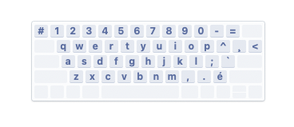

# FrenchLearning
French Learning Roadmap &amp; Everything

---

## I - Keyboard Choice

### CA Canadian - Mac

| Character | How to Type | Location                             |
| --------- | ----------- | ------------------------------------ |
| **é**     | `é`         | Located in the lower right corner `` |
| **è**     | `` + e` = è | Located in the right side ``         |
| **ê**     | `^ + e` = ê | Located in the right side ``         |
| **à**     | `` + a` = à | Located in the right side ``         |
| **â**     | `^ + a` = â | Located in the right side ``         |
| **ç**     | `¸ + c` = ç | Located in the right side ``         |
| **ô**     | `^ + o` = ô |                                      |
| **ù**     | `` + u` = ù |                                      |
| **ë**     |             |                                      |

### CA Canadian – PC

#### 🇨🇦 Canadian – PC Keyboard: French Accents & Symbols Cheat Sheet

##### 🔤 Accented Letters

| Character | How to Type                         |
| --------- | ----------------------------------- |
| **é**     | `Right Alt (AltGr)` + `e`           |
| **è**     | `Right Alt (AltGr)` + `7`           |
| **ê**     | `Right Alt (AltGr)` + `9`, then `e` |
| **à**     | `Right Alt (AltGr)` + `0`, then `a` |
| **â**     | `Right Alt (AltGr)` + `9`, then `a` |
| **ç**     | `Right Alt (AltGr)` + `c`           |
| **ô**     | `Right Alt (AltGr)` + `9`, then `o` |
| **ù**     | `Right Alt (AltGr)` + `7`, then `u` |
| **ë**     | `Right Alt (AltGr)` + `¨`, then `e` |

##### 🧠 Punctuation & Special Symbols

| Symbol          | How to Type                         |
| --------------- | ----------------------------------- |
| **«**           | `Right Alt (AltGr)` + `[`           |
| **»**           | `Right Alt (AltGr)` + `]`           |
| **€**           | `Right Alt (AltGr)` + `2`           |
| **°**           | `Right Alt (AltGr)` + `Shift` + `;` |
| **œ**           | `Right Alt (AltGr)` + `o`           |
| **–** (en dash) | `Right Alt (AltGr)` + `-`           |

##### 💡 Tips

- `AltGr` = **Right Alt key**
- On macOS, you can also **hold a letter key (like `e`)** to get accent options popup.
- You can install **Canadian – PC layout** via:  
  **System Settings → Keyboard → Input Sources → Add → French → Canadian – PC**

---

## II - Roadmap & Timeline Breakdown

### [Method]

#### I - Content

- **Content** of 2 ~ 5 min video clips

#### II - Looping Action

* **Pre-analyze && Vocabulary Management && Looping 0.6 && Looping 0.8 && Looping 1.0**

#### III - Extra

1. Visual Vocabulary
2. GenAI Q&A && GenAI Visualization

### Phase 1

* content x 50
* finish setup workflow

### Phase 2

* content x 100

